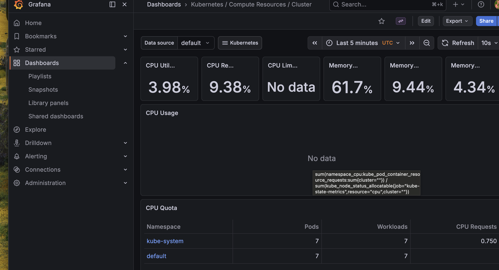

# ai_cloudmonitor_project# AI-Powered Cloud Monitoring & Auto-Remediation System

##  Overview
Built a cloud-native monitoring and self-healing system using Kubernetes, Prometheus, Grafana, and Python.

##  Features
- Real-time monitoring using Prometheus
- Visualization using Grafana dashboards
- Python-based anomaly detection
- Automated pod restart (self-healing system)
- Kubernetes-based deployment

## Tech Stack
- Kubernetes (Minikube)
- Prometheus
- Grafana
- Python (NumPy)
- Docker

## Workflow
1. Application deployed on Kubernetes
2. Metrics collected via Prometheus
3. Visualized in Grafana dashboards
4. Python detects anomalies
5. Kubernetes auto-recovers via pod restart

## 📊 Screenshots

## 💡 Use Case
- Detect abnormal system behavior
- Reduce downtime using self-healing
- Monitor infrastructure in real-time